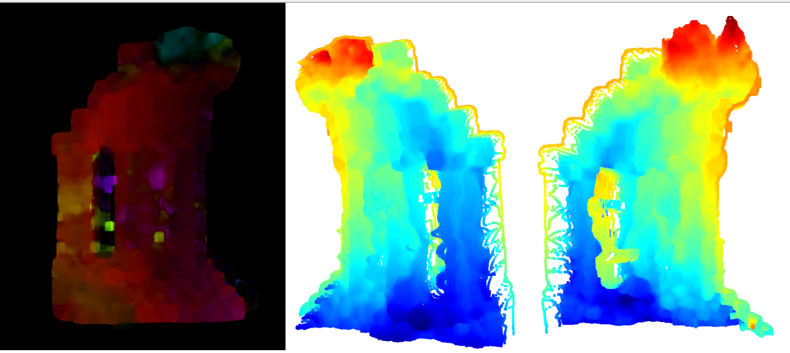

# Non stereo scene Reconstruction

Reconstruction of a scene given two non stereo images and the camera intrinsic parameters matrix. Four different methods are implemented, the first three perform a sparse reconstruction using feature matching ([SIFT](https://medium.com/data-breach/introduction-to-sift-scale-invariant-feature-transform-65d7f3a72d40) and [SURF](https://medium.com/data-breach/introduction-to-surf-speeded-up-robust-features-c7396d6e7c4e)) or sparse optical flow ([Lucas-Kanade](https://en.wikipedia.org/wiki/Lucas%E2%80%93Kanade_method)). The fourth method performs a dense reconstruction using optical flow ([Farneback](https://www.geeksforgeeks.org/opencv-the-gunnar-farneback-optical-flow/)).


The workflow of this project is based on the examples provided in the book: **Mastering OpenCV with Practical Computer Vision Projects**.

## Prerequisites

Install the [OpenCV](https://www.pyimagesearch.com/2018/08/15/how-to-install-opencv-4-on-ubuntu/). When running the cmake, make sure to enable the non free packages in order to be able to use the [SIFT](https://medium.com/data-breach/introduction-to-sift-scale-invariant-feature-transform-65d7f3a72d40) and [SURF](https://medium.com/data-breach/introduction-to-surf-speeded-up-robust-features-c7396d6e7c4e) features. 

```sh
cmake -D CMAKE_BUILD_TYPE=RELEASE \
	-D CMAKE_INSTALL_PREFIX=/usr/local \
	-D INSTALL_PYTHON_EXAMPLES=ON \
	-D INSTALL_C_EXAMPLES=OFF \
	-D OPENCV_ENABLE_NONFREE=ON \
	-D OPENCV_EXTRA_MODULES_PATH=~/opencv_contrib/modules \
	-D PYTHON_EXECUTABLE=~/.virtualenvs/cv/bin/python \
	-D BUILD_EXAMPLES=ON .
```
For the scene point cloud visualization, the python library is used. In order to install it:

```sh
pip install open3d 
```
## Usage
The program takes as input: the path to the two images, the path to a .txt file containing the camera intrisic parameters matrix, the type of features used for the reconstruction, and optionally, the feature matching method which is set by default to bruteforce.

```bash
Usage: scene_reconstruction [params] image1 image2 

    -K (value:./path/to/K.txt)
		intrisic parameters matrix path
	--features (value:sift)
		feature type , SIFT, SURF, OF_SPARSE, OF_DENSE
	--help (value:true)
		print this message
	--matcher (value:bruteforce)
		matcher type

	image1 (value:./img1.jpg)
		image1 path
	image2 (value:./img2.jpg)
		image2 path

```
An example would be:

```bash
./scene_reconstruction ../images/pic1.png ../images/pic2.png -K=../intrisic_matrix.txt -features=SIFT
```

## Results

<br />
<h3 align="center">SIFT: Matching points and Reconstructed Scene</h3>
<p align="center">
  <a href="https://github.com/othneildrew/Best-README-Template">
    
  </a>
</p>

<h3 align="center">SURF: Matching points and Reconstructed Scene</h3>
<p align="center">
  <a href="https://github.com/othneildrew/Best-README-Template">
    
  </a>
</p>

<h3 align="center">Sparse Optical Flow: Points flow and Reconstructed Scene</h3>
<p align="center">
  <a href="https://github.com/othneildrew/Best-README-Template">
    
  </a>
</p>

<h3 align="center">Dense Optical Flow: Image flow and Reconstructed Scene</h3>
<p align="center">
  <a href="https://github.com/othneildrew/Best-README-Template">
    
  </a>
</p>
